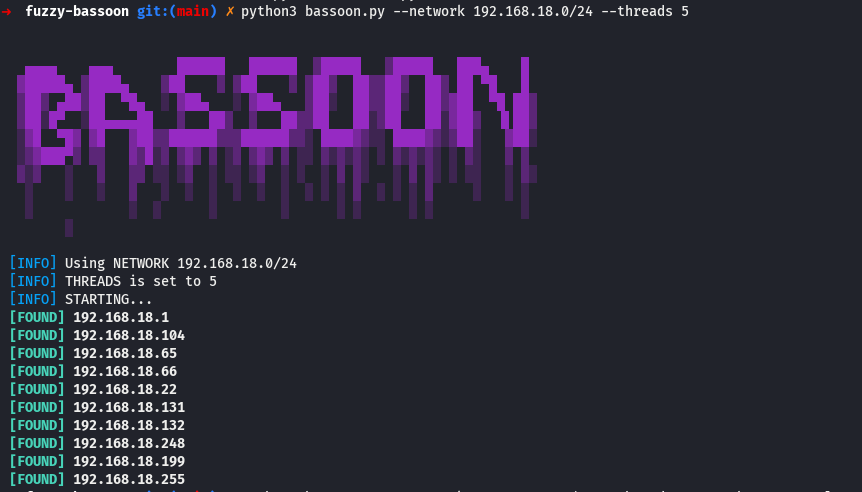

# bassoon
Tool for finding other hosts in local network.



## Installation
```
wget adress
```
## Usage

### Simple Scan (One-thread, not recommended)
```
python3 bassoon.py --network 192.168.10.0/24
```

### Multithreading
```
python3 bassoon.py --network 192.168.10.0/24 --threads 5
```

### Verbose and No-color
```
python3 bassoon.py --network 192.168.10.0/24 --threads 3 --verbose --nocolor 
```
