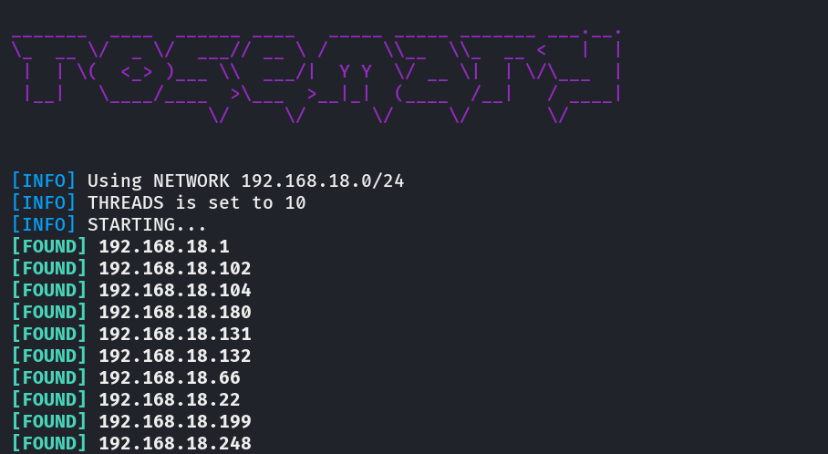

# rosemary
Tool for finding devices in a network using ICMP Protocol.



## Installation
```
wget https://raw.githubusercontent.com/entr0pie/rosemary/main/rosemary.py
```

## Usage
### Simple Scan (Dual Thread)
```
python3 rosemary.py --network 192.168.10.0/24
```
### Multithreading
```
python3 rosemary.py --network 192.168.10.0/24 --threads 5
```
### Verbose and No-color
```
python3 rosemary.py --network 192.168.10.0/24 --threads 3 --verbose --nocolor 
```
## License 
This project is under [GNU GPL3](https://www.gnu.org/licenses/gpl-3.0.html). 
